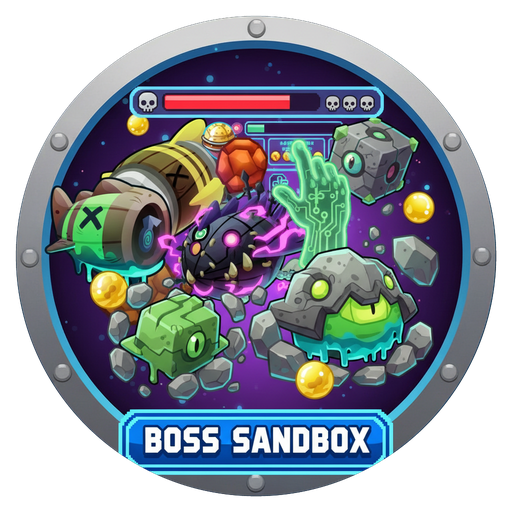

<h1 align="center">

</h1>
<h3 align="center">Adds BossUI, Health bar, Tiers, Skulls, etc... and all Boss Bloons (Bloonarius, Vortex, Lych, Dreadbloon, Phayze + Elite), golden blons, and Dreadbloon rocks to SandBox mode.</h3>
<h1 align="center">Boss UI in SandBox</h1>

